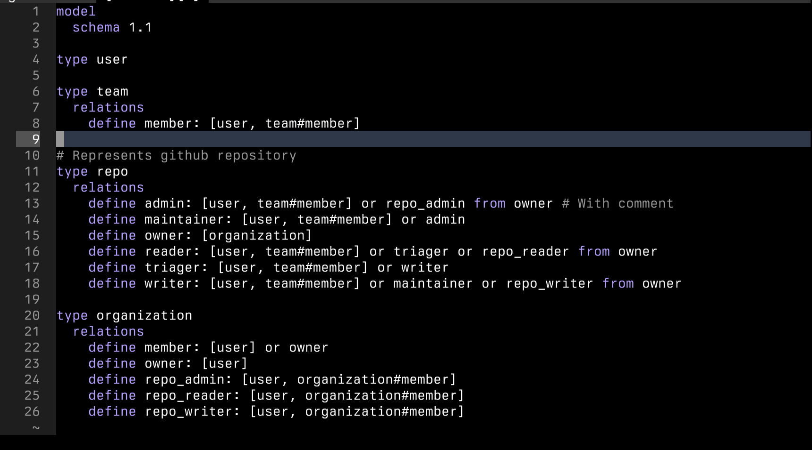

# tree-sitter-fga

A [tree sitter](https://github.com/tree-sitter/tree-sitter) grammer for [OpenFGA](https://openfga.dev/) authorization schema language.

See https://openfga.dev/docs/configuration-language for the configuration language semantics.

## Development

Install `tree-sitter-cli`, see [installation instructions](https://tree-sitter.github.io/tree-sitter/creating-parsers#installation).
